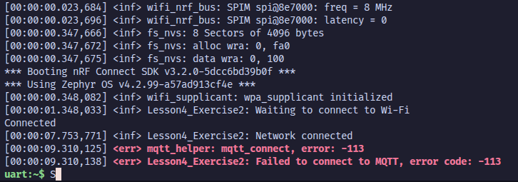

# Wi-Fi Fundamentals - MQTT with TLS (l4_e2_sol_rev2)

Zephyr-based Wi-Fi MQTT application with TLS support, targeting the **nRF54H20DK** with **nRF7002EK** shield.

This project is based on the [Nordic Wi-Fi Fundamentals Course - Lesson 4 Exercise 2](https://academy.nordicsemi.com/courses/wi-fi-fundamentals/lessons/lesson-4-wifi-fundamentals/topic/lesson-4-exercise-2-2/) with custom nRF54H20 configuration files.

**Original source:** [wifi-fund/l4/l4_e2_sol](https://github.com/NordicDeveloperAcademy/wifi-fund/tree/main/l4/l4_e2_sol)

## Overview

This project connects to an MQTT broker (`test.mosquitto.org`) over TLS (port 8883) using the nRF70 Wi-Fi companion IC. It publishes button events and subscribes to LED control topics.

## Hardware Setup

- **Board:** nRF54H20DK + nRF7002EK (Wi-Fi companion shield)
- **Wiring:**
  - `V5V` <-> `5V` (nRF54H20)
  - `VIO` <-> `VDD_P000` (nRF54H20)

### Pin Configuration

| Function           | Pin Assignment               |
| ------------------ | ---------------------------- |
| `iovdd-ctrl-gpios` | `&gpio1 5 GPIO_ACTIVE_HIGH`  |
| `bucken-gpios`     | `&gpio1 11 GPIO_ACTIVE_HIGH` |
| `host-irq-gpios`   | `&gpio1 6 GPIO_ACTIVE_HIGH`  |
| `SPIM_SCK`         | `P7.2`                       |
| `SPIM_MISO`        | `P7.0`                       |
| `SPIM_MOSI`        | `P7.1`                       |

## Building

### Don't forget to include `nrf70-wifi`

```bash
west build --build-dir . --pristine --board nrf54h20dk@0.9.0/nrf54h20/cpuapp -- -DSNIPPET=nrf70-wifi -DDEBUG_THREAD_INFO=On -DCONFIG_DEBUG_THREAD_INFO=y -Dl4_e2_sol_rev2_DEBUG_THREAD_INFO=On -Duicr_DEBUG_THREAD_INFO=Off
```

## Configuration

### Board-specific config (`boards/nrf54h20dk_nrf54h20_cpuapp.conf`)

- Nordic Security Backend and nRF Security enabled
- mbedTLS with TLS client, PEM parsing, SNI, GCM, and PSA crypto
- mbedTLS debug logging (level 4)
- Wi-Fi credentials backend using NVS/settings

### Board-specific overlay (`boards/nrf54h20dk_nrf54h20_cpuapp.overlay`)

- SPI121 configured for nRF7002 communication
- GPIO nodes enabled for shield control
- DMA fast region enabled for SPI transfers

### Project config (`prj.conf`)

- Wi-Fi with WPA supplicant
- MQTT with TLS (port 8883, sec tag 24)
- Publish topic: `wifi/fund/board/publish/button/topic99`
- Subscribe topic: `wifi/fund/board/subscribe/led/topic99`
- Broker: `test.mosquitto.org`
- TLS certificate located in `src/credentials/`

## Project Structure

```
l4_e2_sol_rev2/
├── CMakeLists.txt
├── prj.conf
├── sysbuild.conf
├── Kconfig
├── sample.yaml
├── boards/
│   ├── nrf54h20dk_nrf54h20_cpuapp.conf
│   ├── nrf54h20dk_nrf54h20_cpuapp.overlay
│   ├── nrf5340dk_nrf5340_cpuapp_ns.conf
│   └── nrf7002dk_nrf5340_cpuapp_ns.conf
└── src/
    ├── main.c
    └── credentials/
        └── ca-cert.pem
```

## Known Issues

### MQTT Connection Error (-113)

**Status:** Wi-Fi connects successfully, but MQTT TLS connection fails with error `-113` (EHOSTUNREACH - No route to host).

**Log Output:**
```
*** Booting nRF Connect SDK v3.2.0-5dcc6bd39b0f ***
*** Using Zephyr OS v4.2.99-a57ad913cf4e ***
[00:00:00.339,369] <inf> wifi_supplicant: wpa_supplicant initialized
[00:00:01.339,294] <inf> Lesson4_Exercise2: Waiting to connect to Wi-Fi
uart:~$ wifi connect -s ssid -k 1 -p somelongpassword
Connection requested
Connected
[00:00:13.137,020] <inf> Lesson4_Exercise2: Network connected
[00:00:23.137,278] <inf> Lesson4_Exercise2: Initializing MQTT helper...
[00:00:23.138,540] <inf> Lesson4_Exercise2: MQTT client ID: nrf54h20dk-0350820575
[00:00:23.138,545] <inf> Lesson4_Exercise2: Connecting to MQTT broker...
[00:00:23.874,802] <err> mqtt_helper: mqtt_connect, error: -113
[00:00:23.874,812] <err> Lesson4_Exercise2: Failed to connect to MQTT, error code: -113
```

**Observations:**
- Wi-Fi connection and DHCP work correctly
- Error occurs during TLS handshake with `test.mosquitto.org:8883`
- mbedTLS debug output (level 4) is enabled but not showing logs

**Troubleshooting Steps Attempted:**
- ✅ Updated to NCS 3.2.0
- ✅ Enabled Nordic Security Backend (`CONFIG_NORDIC_SECURITY_BACKEND=y`)
- ✅ Configured mbedTLS debug logging (no output observed)
- ❌ TLS connection still failing

